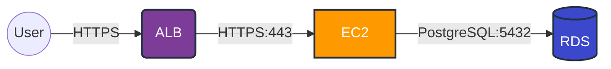
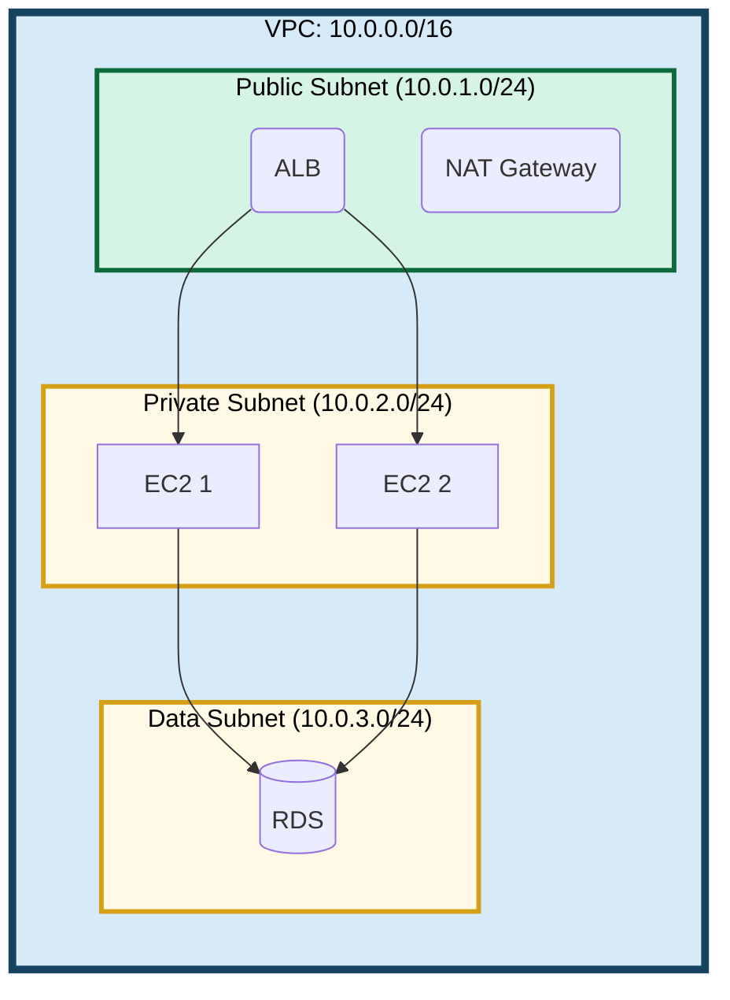
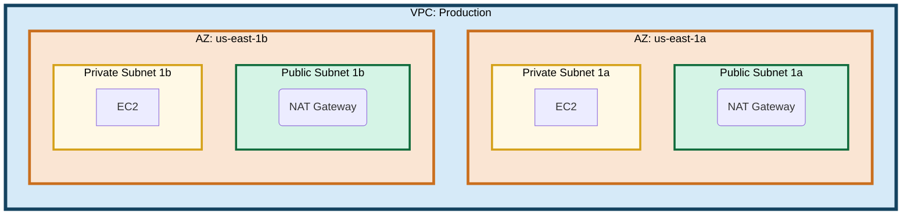
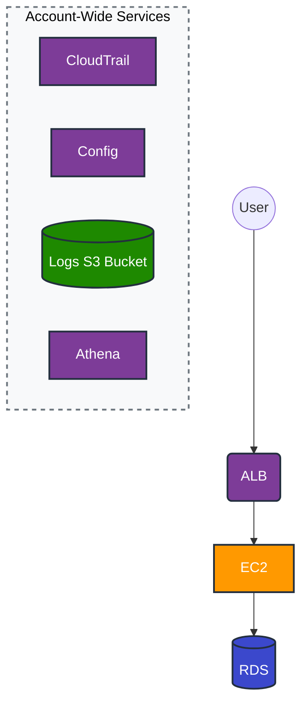
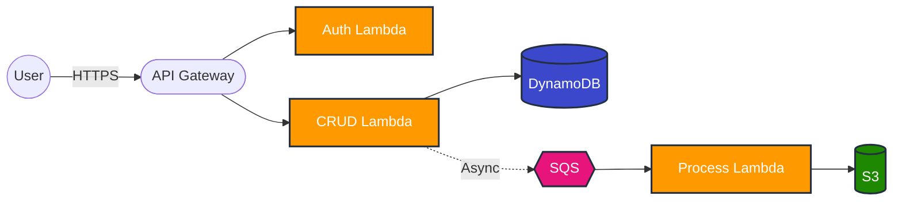

# Mermaid AWS Diagram Generator

## Overview

Generate AWS architecture diagrams using Mermaid Flowchart syntax that are both human-readable and AI-parseable. These diagrams can be embedded directly in markdown files, version-controlled, and used as input for Infrastructure as Code generation.

## Core Workflow

### 1. Understand Requirements

Extract from user request:
- **Services**: Which AWS services? (EC2, RDS, Lambda, S3, ALB, etc.)
- **Network structure**: VPC, subnets (public/private/data), multi-AZ?
- **Regions**: Single or multi-region?
- **Connections**: How do services communicate? (HTTPS, database connections, async queues)
- **Detail level**: Basic topology or detailed configuration?

### 2. Structure the Diagram

Use this hierarchy (from outer to inner):
```
Region (optional)
└── VPC
    └── Availability Zone (optional)
        └── Subnet (Public/Private/Data)
            └── Resources (EC2, RDS, etc.)
```

**Direction choice (flexible):**
- `graph LR` (Left to Right): Common for sequential flows (User → ALB → App → Database)
- `graph TB` (Top to Bottom): Better for multi-AZ layouts, hierarchical structures, or when emphasizing vertical organization
- Choose based on what makes the diagram clearest - there is no strict rule

### 3. Apply Naming Conventions

**Node IDs:**
```
{service}_{number}_{role}
```

Examples:
- `ec2_1_web` - Web server EC2
- `rds_1_primary` - Primary RDS
- `alb_1_public` - Public ALB

**Subgraph IDs:**
```
{type}_{name}
```

Examples:
- `vpc_prod` - Production VPC
- `subnet_public_1a` - Public subnet in AZ 1a
- `region_us_east` - US East region

### 4. Choose Node Shapes

Match AWS service types:

| Shape | Syntax | Services |
|-------|--------|----------|
| Rectangle | `[...]` | EC2, Lambda, ECS |
| Rounded | `(...)` | ALB, NLB, NAT Gateway |
| Stadium | `([...])` | API Gateway |
| Cylinder | `[(...)` | RDS, DynamoDB, S3 |
| Circle | `((...))` | User, Internet |
| Diamond | `{...}` | Route53, CloudFront, Transit Gateway |
| Hexagon | `{{...}}` | SQS, SNS |
| Subroutine | `[[...]]` | **Endpoints**: VPC Endpoints (Interface/Gateway), Network Firewall Endpoints, TGW ENI |

**Special: Endpoints** use double-bracket `[[...]]` to distinguish from regular resources. These represent network attachment points rather than standalone services.

### 5. Define Connections

**Protocol notation:**
```
alb -->|HTTPS:443| ec2        # Synchronous
ec2 -.->|Async| sqs            # Asynchronous (dotted)
lambda ==>|Main| dynamodb      # Primary flow (thick)
```

Always include protocol and port in edge labels.

**Arrow colors (improving visibility):**

Default Mermaid arrow colors are light and hard to see. Specify darker colors for important connections:

```
%% Normal traffic flow
alb -->|HTTPS:443| ec2

%% Important flow (darker color for emphasis)
ec2 -->|PostgreSQL:5432| rds
linkStyle 1 stroke:#2C3E50,stroke-width:2px

%% Replication (dashed + darker color)
rds_primary -.->|Replication| rds_standby
linkStyle 2 stroke:#7F8C8D,stroke-width:2px
```

**Using linkStyle:**
- Add `linkStyle <index> stroke:<color>,stroke-width:<width>` at the end of diagram
- Index starts from 0, following the order of connection definitions
- Recommended colors: `#2C3E50` (dark gray), `#7F8C8D` (medium gray)

### 6. Apply Colors

**Two-level coloring system:**

**A. Infrastructure Hierarchy (subgraphs)**

See `references/colors.md` for complete definitions.

Key colors:
- **VPC**: `fill:#D6EAF8,stroke:#154360,stroke-width:5px,color:#000`
- **Public Subnet**: `fill:#D5F4E6,stroke:#0E6A3A,stroke-width:3px,color:#000` (green)
- **Private/Data Subnet**: `fill:#FFF9E6,stroke:#D4A017,stroke-width:3px,color:#000` (yellow)
- **Special Purpose Subnet**: `fill:#E8EAED,stroke:#5F6368,stroke-width:3px,color:#000` (gray)

**Important principles:**
- **Color-code by subnet type**:
  - Public subnets use green
  - Private/Data subnets use yellow
  - Special purpose subnets (Firewall, TGW Attach) use gray
- Same subnet type = same color
- Same hierarchy level (VPC, AZ) = same color regardless of instance

**B. AWS Services (resources)**

```
classDef compute fill:#FF9900,stroke:#232F3E,stroke-width:2px,color:#fff
classDef database fill:#3B48CC,stroke:#232F3E,stroke-width:2px,color:#fff
classDef storage fill:#1E8900,stroke:#232F3E,stroke-width:2px,color:#fff
classDef network fill:#7D3C98,stroke:#232F3E,stroke-width:2px,color:#fff
classDef integration fill:#E7157B,stroke:#232F3E,stroke-width:2px,color:#fff
classDef endpoint fill:#5DADE2,stroke:#1B4F72,stroke-width:2px,color:#fff
```

**Endpoint class**: Use for VPC Endpoints, Network Firewall Endpoints, TGW ENIs, and other network attachment points. Light blue color distinguishes them from regular network services.

### 7. Add Metadata (Optional)

For basic diagrams, metadata is optional. Include only when needed for IaC generation:

```
graph LR
    %% @diagram
    %% name: Production Web Service
    %% version: 1.0.0
    %% region: us-east-1
    %% @end
```

**Resource parameters (instance_type, AMI, etc.) are NOT required** unless creating detailed design documents.

## Common Patterns

### Pattern 1: Simple 3-Tier Architecture



### Pattern 2: VPC with Subnets



### Pattern 3: Multi-AZ Setup



### Pattern 4: Account-Wide Services (Logging & Auditing)

When showing account-wide logging and auditing services (CloudTrail, Config, CloudWatch Logs, etc.), do **NOT** draw arrows from individual resources. These services operate globally across the account.

**Key principles:**
- Group these services together in a separate area (e.g., corner or side of diagram)
- No arrows from application resources to logging services
- Even if logs are stored in S3, do NOT draw arrows to S3 - the S3 bucket's existence is enough
- Same for Athena querying logs - show Athena if relevant, but no connection arrows needed



**Why no arrows:**
- CloudTrail/Config automatically capture events from all resources
- Drawing arrows from every resource would clutter the diagram
- The grouped display indicates these are account-wide, not resource-specific

### Pattern 5: Serverless Architecture



## Important Guidelines

1. **Prefer simplicity**: Start with basic topology, add details only when requested
2. **Subnet color-coding**:
   - Public subnets use green (`#D5F4E6` / `#0E6A3A`)
   - Private/Data subnets use yellow (`#FFF9E6` / `#D4A017`)
   - Special purpose subnets use gray (`#E8EAED` / `#5F6368`) - Firewall, TGW Attach
   - All subnets of the same type use the same color
3. **Protocol labels**: Always include protocol and port (e.g., `HTTPS:443`, `PostgreSQL:5432`)
4. **High contrast**: Always use `color:#000` for subgraph text
5. **Arrow visibility**: Use `linkStyle` to make important connections more visible with darker colors
6. **Metadata optional**: Resource parameters (instance_type, etc.) are NOT required for basic diagrams
7. **Account-wide services**: Group CloudTrail, Config, CloudWatch Logs, etc. separately with NO arrows from application resources - they operate globally

## When to Load References

- **Always load** `references/colors.md` when dealing with VPC/subnet/multi-AZ/multi-region hierarchies
- **Load** `references/conventions.md` when user asks for detailed specifications or when creating complex diagrams with many services

## AWS Service Abbreviations

Quick reference for common services:

| Service | Abbreviation | Shape | Class |
|---------|-------------|-------|-------|
| EC2 | `ec2` | `[...]` | `compute` |
| RDS | `rds` | `[(...]` | `database` |
| Lambda | `lambda` | `[...]` | `compute` |
| S3 | `s3` | `[(...]` | `storage` |
| ALB/NLB | `alb`, `nlb` | `(...)` | `network` |
| API Gateway | `apigw` | `([...])` | `network` |
| DynamoDB | `dynamodb` | `[(...]` | `database` |
| SQS | `sqs` | `{{...}}` | `integration` |
| SNS | `sns` | `{{...}}` | `integration` |
| CloudFront | `cf` | `{...}` | `network` |
| Route53 | `r53` | `{...}` | `network` |
| Transit Gateway | `tgw` | `{...}` | `network` |
| **VPC Endpoint** | `vpce` | `[[...]]` | `endpoint` |
| **NFW Endpoint** | `nfw_ep` | `[[...]]` | `endpoint` |
| **TGW ENI** | `tgw_eni` | `[[...]]` | `endpoint` |
| CloudTrail | `cloudtrail` | `[...]` | `network` |
| Config | `config` | `[...]` | `network` |
| Athena | `athena` | `[...]` | `database` |

## Resources

### references/conventions.md
Complete Mermaid syntax rules, node shapes, styling guidelines. Load when creating complex diagrams or when user requests detailed specifications.

### references/colors.md
Infrastructure hierarchy color definitions (AWS Org → Account → Region → AZ → VPC → Subnet). Load when creating diagrams with VPC/subnet structures or multi-region setups.
