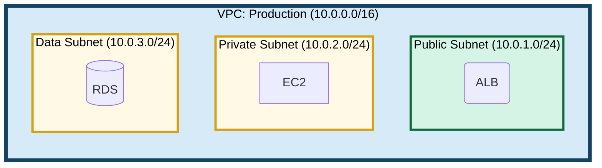
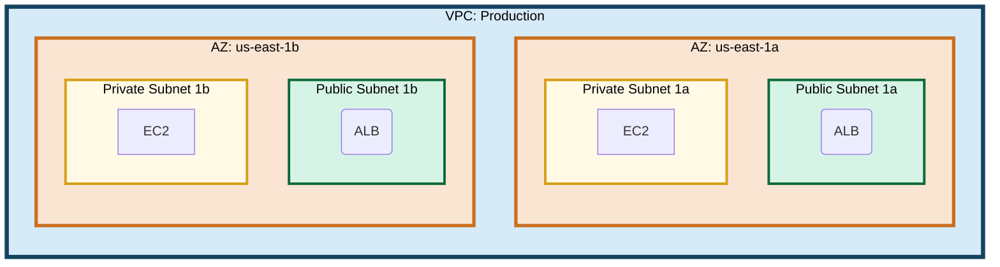
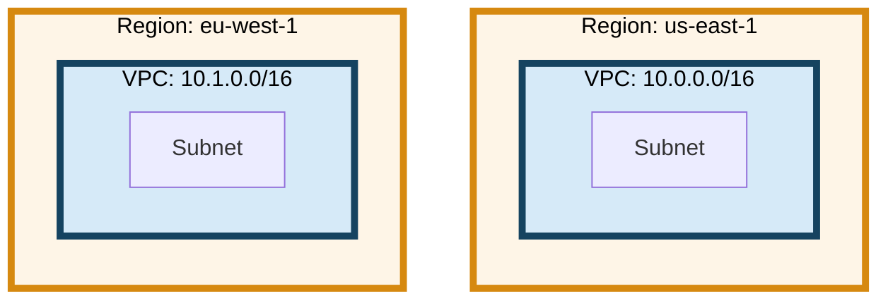

# AWS Infrastructure Hierarchy Color Definitions

## Hierarchy Structure and Color Mapping

AWS architecture diagrams represent the following hierarchy structure, with unique colors assigned to each level.

### Hierarchy Levels

```
AWS Organization (optional)
└── Account
    └── Region
        └── Availability Zone (optional)
            └── VPC
                └── Subnet (Public/Private/Data)
                    └── Resources (EC2, RDS, etc.)
```

## Subgraph Color Definitions

### Level 1: AWS Organization (Outermost)

Rarely used, but employed when showing multi-account configurations.

```
fill: #F0F0F0
stroke: #2C3E50
stroke-width: 6px
color: #000
```

**Purpose:** Top-level group that contains multiple AWS accounts

### Level 2: Account

```
fill: #E8F4F8
stroke: #1F618D
stroke-width: 5px
color: #000
```

**Purpose:** AWS account boundary (for multi-account configurations)

### Level 3: Region

```
fill: #FEF5E7
stroke: #D68910
stroke-width: 5px
color: #000
```

**Purpose:** AWS Region (us-east-1, ap-northeast-1, etc.)

### Level 4: Availability Zone (Optional)

```
fill: #FAE5D3
stroke: #CA6F1E
stroke-width: 4px
color: #000
```

**Purpose:** When explicitly separating by AZ (1a, 1b, 1c, etc.)

### Level 5: VPC

```
fill: #D6EAF8
stroke: #154360
stroke-width: 5px
color: #000
```

**Purpose:** Virtual Private Cloud boundary

### Level 6: Subnet

**Design Principle: Color-code by subnet type for clarity**

Different subnet types use different colors to make their roles immediately clear in the diagram.

#### Public Subnet

Subnets with routes to Internet Gateway (ALB, NAT Gateway, etc.)

```
fill: #D5F4E6
stroke: #0E6A3A
stroke-width: 3px
color: #000
```

**Color rationale:**
- Light green (#D5F4E6): Indicates "public" connectivity, outward-facing
- Dark green border (#0E6A3A): Clearly shows public subnet boundaries

#### Private Subnet

Subnets without direct internet access (EC2, ECS, etc.)

```
fill: #FFF9E6
stroke: #D4A017
stroke-width: 3px
color: #000
```

**Color rationale:**
- Light yellow (#FFF9E6): Neutral, internal-focused color
- Dark gold border (#D4A017): Clearly shows private subnet boundaries

#### Data Subnet

Database-dedicated subnets (RDS, ElastiCache, etc.)

```
fill: #FFF9E6
stroke: #D4A017
stroke-width: 3px
color: #000
```

**Note:** Data subnets use the same color as private subnets since they're essentially private subnets with restricted access.

#### Special Purpose Subnets

For Firewall Subnet, TGW Attach Subnet, and other infrastructure-related subnets:

```
fill: #E8EAED
stroke: #5F6368
stroke-width: 3px
color: #000
```

**Applies to:**
- Firewall Subnet - Network Firewall endpoint subnets
- TGW Attach Subnet - Transit Gateway attachment subnets
- Other infrastructure-only subnets

**Color rationale:**
- Light gray (#E8EAED): Neutral, infrastructure-focused color
- Dark gray border (#5F6368): Clearly distinguishes from application subnets

## Important Principles

1. **Same type uses same color**
   - If Subnet A and Subnet B are both Public Subnets, both use the same green color
   - If Subnet A and Subnet B are both Private Subnets, both use the same yellow color
   - If Subnet A and Subnet B are both Special Purpose Subnets, both use the same gray color
   - VPC-A and VPC-B both use the same VPC blue color

2. **High contrast**
   - Always specify `color: #000` (black text)
   - Use dark colors for borders
   - Borders must be 3px or thicker

3. **Border thickness based on nesting depth**
   - Outer levels use thicker borders (5-6px)
   - Inner levels use thinner borders (3-4px)

## Usage Examples

### Basic VPC Configuration



### Multi-AZ Configuration



### Multi-Region Configuration



## Style Definition Template

Add the following at the end of Mermaid diagrams:

```mermaid
%% Hierarchy Colors
style org_xxx fill:#F0F0F0,stroke:#2C3E50,stroke-width:6px,color:#000
style account_xxx fill:#E8F4F8,stroke:#1F618D,stroke-width:5px,color:#000
style region_xxx fill:#FEF5E7,stroke:#D68910,stroke-width:5px,color:#000
style az_xxx fill:#FAE5D3,stroke:#CA6F1E,stroke-width:4px,color:#000
style vpc_xxx fill:#D6EAF8,stroke:#154360,stroke-width:5px,color:#000

%% Subnets (by type)
style subnet_public_xxx fill:#D5F4E6,stroke:#0E6A3A,stroke-width:3px,color:#000
style subnet_private_xxx fill:#FFF9E6,stroke:#D4A017,stroke-width:3px,color:#000
style subnet_data_xxx fill:#FFF9E6,stroke:#D4A017,stroke-width:3px,color:#000
style subnet_firewall_xxx fill:#E8EAED,stroke:#5F6368,stroke-width:3px,color:#000
style subnet_tgw_xxx fill:#E8EAED,stroke:#5F6368,stroke-width:3px,color:#000
```

## AWS Service Colors (Resource Level)

For resources themselves (EC2, RDS, etc.), use AWS official brand colors:

| Category | Color | Class Name | Target Services |
|---------|--------|---------|------------|
| Compute | `#FF9900` | `compute` | EC2, Lambda, ECS |
| Database | `#3B48CC` | `database` | RDS, DynamoDB |
| Storage | `#1E8900` | `storage` | S3, EBS, EFS |
| Network | `#7D3C98` | `network` | ELB, CloudFront, Route53, Transit Gateway |
| Integration | `#E7157B` | `integration` | SQS, SNS, EventBridge |
| Security | `#DD344C` | `security` | IAM, WAF, Shield |
| **Endpoint** | `#5DADE2` | `endpoint` | VPC Endpoints, Network Firewall Endpoints, TGW ENI |

**About Endpoint Category:**
- Represents network attachment points (VPC Endpoints, NFW Endpoints, TGW ENI, etc.)
- Distinguished by a different color because they have a different role from regular network services
- Uses Subroutine shape `[[...]]`

These colors are described in detail in Chapter 7 of `mermaid_conventions.md`.
