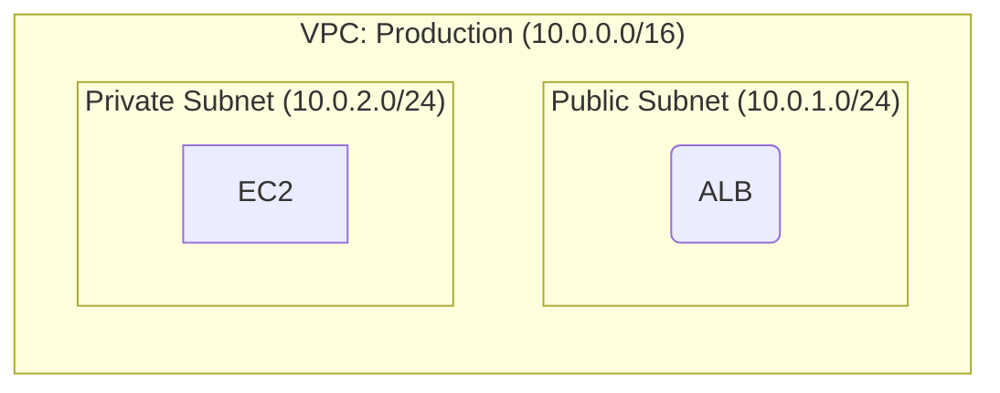
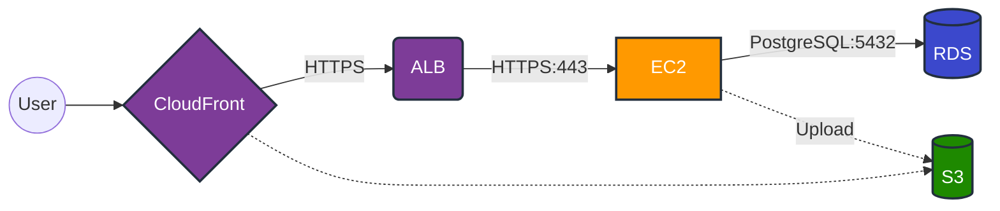

# Mermaid AWS Architecture Diagram Conventions

This document summarizes important rules extracted from `/Users/hakira/Programs/architecture_digram/mermaid_conventions.md`.
For complete details, refer to the original file.

## 1. Basic Syntax

### Diagram Type
```
graph LR  %% Left to Right (flexible choice)
graph TB  %% Top to Bottom (flexible choice)
```

### Node ID Naming Convention
```
{service}_{number}_{role}
```

**Examples:**
- `ec2_1_web` - EC2 for web server
- `rds_1_primary` - Primary RDS
- `alb_1_public` - Public ALB

**Rules:**
- Lowercase and underscores only
- 3-30 characters
- Clear abbreviations

## 2. Node Shapes

| Shape | Syntax | Usage | Examples |
|-------|--------|-------|----------|
| Rectangle | `[...]` | Compute | EC2, Lambda, ECS |
| Rounded | `(...)` | Network devices | ALB, NLB, NAT Gateway |
| Stadium | `([...])` | API endpoints | API Gateway |
| Cylinder | `[(...)` | Data stores | RDS, DynamoDB, S3 |
| Circle | `((...))` | External entities | User, Internet |
| Diamond | `{...}` | Routing | Route53, CloudFront |
| Hexagon | `{{...}}` | Queues/Events | SQS, SNS |
| Subroutine | `[[...]]` | Endpoints | VPC Endpoints, NFW Endpoints, TGW ENI |

## 3. Edges (Connections)

### Basic Syntax
```
alb -->|HTTPS:443| ec2        %% Normal (synchronous)
ec2 -.->|Async| sqs            %% Asynchronous (dotted)
lambda ==>|Main| dynamodb      %% Primary flow (thick)
service1 <-->|Sync| service2   %% Bidirectional
```

### Protocol Notation
- `HTTPS:443`
- `HTTP:80`
- `PostgreSQL:5432`
- `MySQL:3306`
- `Redis:6379`

## 4. Subgraph (Grouping)

### Basic Syntax


**Rules:**
- IDs use lowercase + underscores
- Include CIDR in display name
- Explicitly specify `direction` (TB or LR)
- Recommended up to 3 nesting levels

## 5. Metadata (Optional)

### Diagram Metadata
```mermaid
graph LR
    %% @diagram
    %% name: Production Web Service
    %% version: 1.0.0
    %% region: us-east-1
    %% @end
```

### Resource Metadata (Only for detailed design)
```
    %% @resource
    %% id: ec2_1_web
    %% type: aws.ec2.instance
    %% config:
    %%   instance_type: t3.medium
    %% @end
    ec2_1_web["EC2 Instance"]
```

**Important:** Resource parameters (instance_type, etc.) are the responsibility of detailed design and are not mandatory.
They can be omitted in basic architecture diagrams.

## 6. Styling

### AWS Service Colors (Resource Level)
```
%% Color definitions
classDef compute fill:#FF9900,stroke:#232F3E,stroke-width:2px,color:#fff
classDef database fill:#3B48CC,stroke:#232F3E,stroke-width:2px,color:#fff
classDef storage fill:#1E8900,stroke:#232F3E,stroke-width:2px,color:#fff
classDef network fill:#7D3C98,stroke:#232F3E,stroke-width:2px,color:#fff
classDef integration fill:#E7157B,stroke:#232F3E,stroke-width:2px,color:#fff
classDef endpoint fill:#5DADE2,stroke:#1B4F72,stroke-width:2px,color:#fff

%% Application
class ec2_1,lambda_1 compute
class rds_1,dynamodb_1 database
class s3_1 storage
class alb_1,cf_1 network
class sqs_1,sns_1 integration
class vpce_1,nfw_ep_1 endpoint
```

### Hierarchy Structure Colors (subgraph)

See `colors.md` for details.

**Subnet color-coding:**
- Public Subnet: Green (`#D5F4E6` / `#0E6A3A`)
- Private/Data Subnet: Yellow (`#FFF9E6` / `#D4A017`)
- Special Purpose Subnet: Gray (`#E8EAED` / `#5F6368`) - Firewall, TGW Attach

**Important principles:**
- Same type uses same color (VPC-A and VPC-B both use same VPC color)
- Same subnet type uses same color (all Public subnets green, all Private yellow, all Special gray)
- High contrast (`color:#000` for black text)
- Border 3px or thicker

## 7. Complete Example



## 8. AWS Service Abbreviations

| Service | Abbreviation |
|---------|--------------|
| EC2 | `ec2` |
| ELB/ALB/NLB | `elb`, `alb`, `nlb` |
| RDS | `rds` |
| S3 | `s3` |
| Lambda | `lambda` |
| DynamoDB | `dynamodb` |
| CloudFront | `cloudfront`, `cf` |
| Route53 | `route53`, `r53` |
| VPC | `vpc` |
| Subnet | `subnet` |
| NAT Gateway | `nat` |
| API Gateway | `apigw` |
| SQS | `sqs` |
| SNS | `sns` |
| ElastiCache | `cache` |
| ECS/Fargate | `ecs`, `fargate` |
| EKS | `eks` |
| VPC Endpoint | `vpce` |
| NFW Endpoint | `nfw_ep` |
| TGW ENI | `tgw_eni` |
| Transit Gateway | `tgw` |

## Top 5 Important Rules

1. **Use `graph LR` or `graph TB`** (Flowchart type - direction is flexible)
2. **Node IDs use `{service}_{number}_{role}` format**
3. **Include protocol info in edges** (`HTTPS:443`, etc.)
4. **Metadata is not mandatory** (can be omitted in basic diagrams)
5. **Use subgraph to group VPC/subnets**
